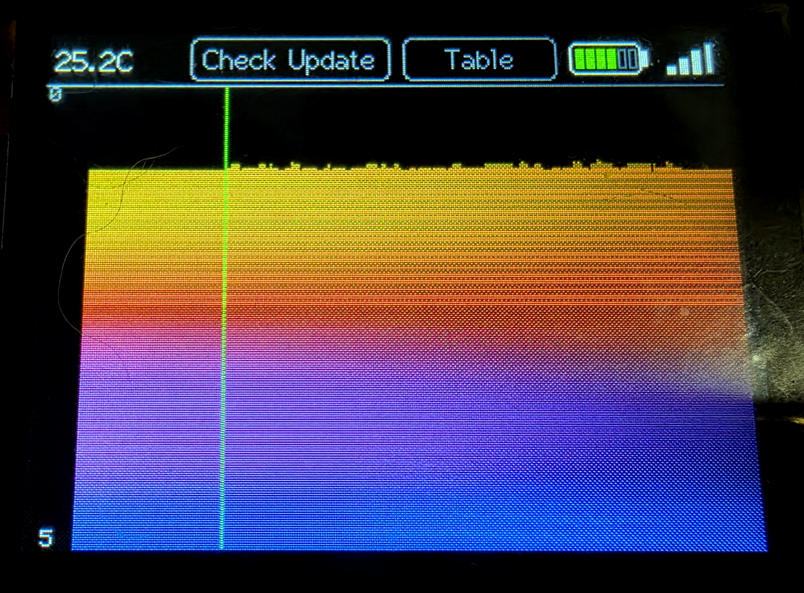
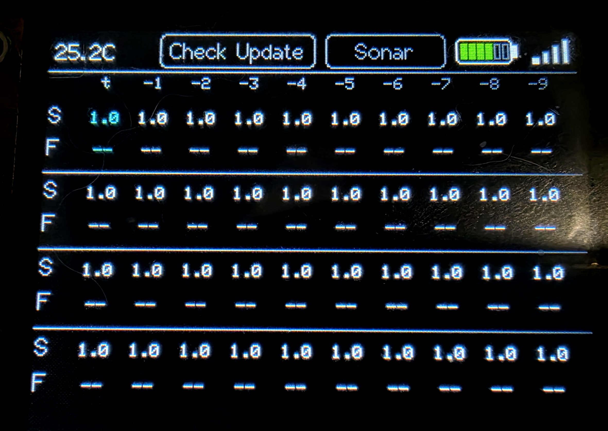
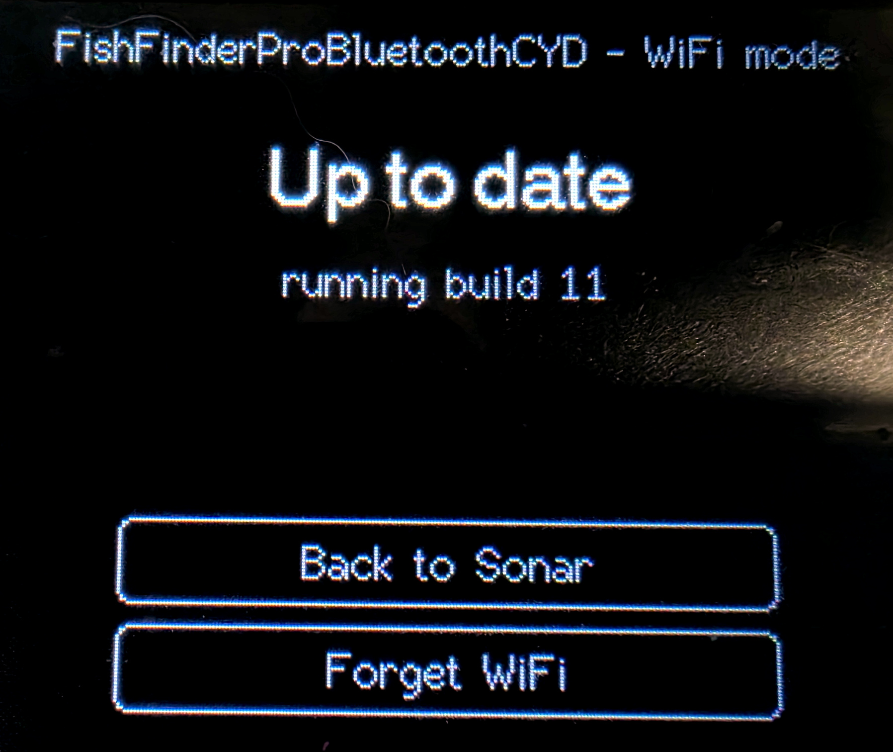
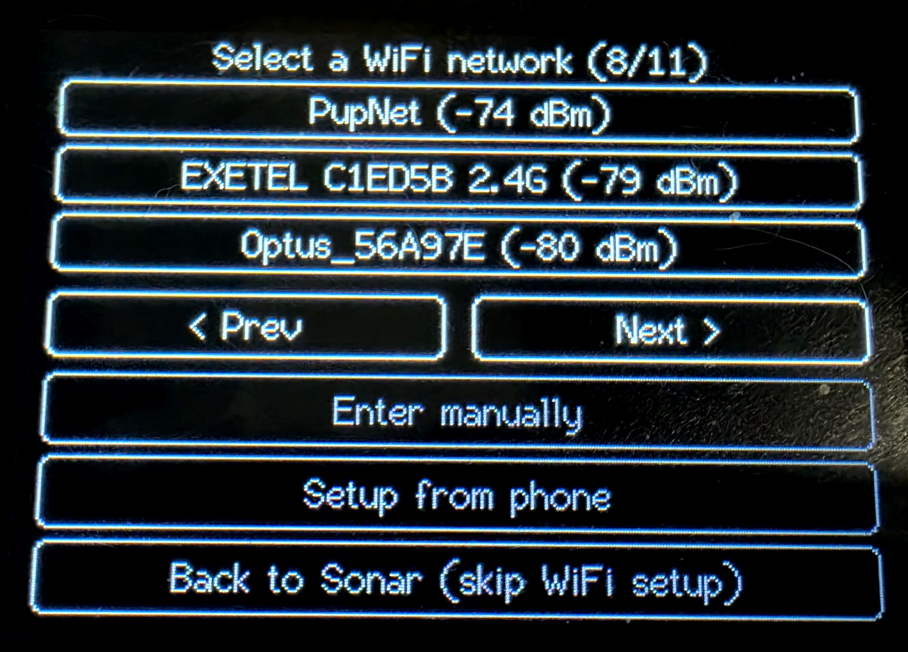

# FishFinderProBluetoothCYD

Standalone display unit for the same "Fish Helper Pro" castable BLE sonar
as [FishFinderProBluetooth](../FishFinderProBluetooth/) - see that
project's README for the full reverse-engineered protocol writeup (GATT
layout, frame format, unit conversions, command format). This project
reuses the same BLE-central/frame-decode logic, but targets a "CYD"
(Cheap Yellow Display) board instead of a bare ESP32-C3, so the depth/
temp/battery reading shows live on a built-in screen instead of (or
alongside) Serial/NMEA output - no laptop or RPi tether needed to see a
reading, which matters for wet-testing at real depth away from a desk.

## Screenshots

**Waterfall view** - depth traced yellow (shallow) through red to blue
(deep), green line marks the sweep's current write position:

**Table view** - scrolling depth/fish-depth history, 1 decimal place:

**OTA check** - confirms the running build and whether an update's
available:

**WiFi network picker** - shown when no WiFi is configured or the last
join failed, paginated with signal strength:

## Board

- Sold as "CYD" (Cheap Yellow Display) - widely available under many
  reseller names, most commonly as **ESP32-2432S028R**.
- Confirmed via `esptool` against a real unit: **ESP32-D0WD-V3** (classic
  WROOM-32 die), 4MB flash, WiFi + Classic BT + BLE, MAC
  `5c:01:3b:33:b3:38`.
- 2.8" 240x320 SPI TFT, ILI9341, XPT2046 resistive touch, CH340
  USB-serial, micro SD slot. Touch is on its own **separate** hardware
  SPI bus (SCK=25, MOSI=32, MISO=39, CS=33 - checked against
  `../EngineControl`'s config for this same board), not sharing the
  display's MISO/MOSI/SCLK, and is fully wired up and calibrated (see
  "Firmware" below) - SD isn't used by this project yet.
- Full 320x240 landscape works correctly. Working TFT_eSPI config is
  `ILI9341_2_DRIVER` + `USE_HSPI_PORT` + 55MHz SPI + `TFT_INVERSION_ON`
  (found by flashing the community's
  [witnessmenow/ESP32-Cheap-Yellow-Display](https://github.com/witnessmenow/ESP32-Cheap-Yellow-Display)
  example repo's `cyd2usb` build variant unmodified onto this exact unit
  first, to rule out a hardware defect before debugging further) - see
  `platformio.ini`'s `build_flags` for the exact config, no library-source
  edits needed.
- WiFi and BLE share one radio and aren't run concurrently - same
  single-radio caveat as FishFinderProBluetooth's C3. Handled by a
  reboot-based mode switch (`op_mode.h`): the sonar display is BLE mode;
  the on-screen "Check Update" button reboots into WiFi mode for OTA and
  comes back once you're done.

## Firmware

`PlatformIO/FishFinderProBluetoothCYD/src/`:

- `sonar_ble.h/.cpp` - BLE central: scans for "Fish Helper Pro", connects,
  subscribes to FFF1, reassembles/decodes frames into a `Reading` struct
  (depth, fish depth, temp, battery, out-of-water/charging flags, frame
  count). Same checksum/unit-conversion formulas as FishFinderProBluetooth.
  Each decoded frame is also logged to Serial as it's read, for sanity-
  checking readings against what the display shows.
- `display.h/.cpp` - TFT_eSPI UI: a phone-style status bar (temp,
  color-coded battery icon, real-RSSI signal bars, Check Update/mode
  buttons) above either of two view modes (see "Display modes" below).
- `touch.h/.cpp` - XPT2046 driver plus a real 2-point on-device
  calibration (auto-triggered on first use, persisted to NVS).
- `keyboard.h/.cpp` - on-screen keyboard (letters/symbols, shift,
  backspace) used for manual WiFi password entry.
- `ota_ui.h/.cpp` - the touch-driven WiFi/OTA admin screen: network
  picker with pagination, password entry, Check Update/Do OTA, Forget
  WiFi, Back to Sonar.
- `web_config.h/.cpp` - a small web UI, reachable only in WiFi mode:
  "setup from phone" (AP-mode credential entry) and the TOBE system section (firmware update, WiFi, log,
  restart) alongside the on-device touch UI.
- `op_mode.h/.cpp` - the NVS-persisted BLE/WiFi mode flag and the
  reboot-based switch between them.
- `main.cpp` - wires it all together.

WiFi (saved credentials, join, the setup network), the OTA download, the log and the serial command line
are the shared TOBE libraries in [`lib/`](../lib/README.md) - not copied into this project any more.
The serial port is the TOBE command line (type `?`): `MODE WIFI` / `MODE BLE`, `STATUS`, `WIFI <ssid> [password]`,
`WEBMODE`, `UPDATE` (WiFi mode), `LOG`, `REBOOT`.

Build with `build/build.sh FishFinderProBluetoothCYD` from the repository root (see
[`build/README.md`](../build/README.md)); the firmware lands in `build/firmware/` as
`TOBE-FishFinderProBluetoothCYD-v<N>.bin`. **Firmware updates ship via OTA, not USB** - see
"Updating this firmware" below.

## Display modes

Toggled via the status bar's mode button:

- **Table** - a scrolling depth/fish-depth history, 10 columns per block
  across 4 stacked blocks (40 samples), 1 decimal place, newest column
  highlighted cyan.
- **Waterfall** - a radar-style sweep: a write head advances one column
  per new sonar reading (not on a fixed timer) and redraws only that
  column - the rest of the screen is never touched - wrapping back to
  the left edge once it reaches the right, like a radar sweep. A green
  line marks the next write position. The seafloor trace is colored by
  depth (yellow at the surface, through red, to blue at the bottom of the
  plot) rather than one flat color. The vertical scale grows immediately
  whenever a reading needs more headroom (never clips), but only
  reconsiders shrinking once per full sweep pass (roughly once a minute
  at the sonar's ~4.5Hz rate) - recomputing it every frame was the
  original cause of a flicker/jitter problem this design replaced.

## Updating this firmware (OTA-only)

This board is normally not connected over USB, so firmware changes ship
via GitHub-release-based OTA, not USB flashing:

1. Bump `FW_BUILD` in `platformio.ini`.
2. Compile only (`pio run`, no `-t upload`) to verify it builds.
3. Commit + push.
4. `gh release create <tag> <firmware.bin>` and compute its MD5.
5. Update `ota/manifest.json` with the new `build`/`url`/`md5`, commit +
   push.
6. On the device: "Check Update" → "Do OTA".

## Next steps

1. SD card logging - the original motivation for considering a CYD at
   all: log raw frames (or decoded NMEA) to the SD card so a wet-test at
   real depth doesn't need a laptop/RPi tether at all. Needs careful SPI
   chip-select handling since SD shares the bus with the display.
2. Touch UI for live sensitivity/range control (mirrors
   FishFinderProBluetooth's `sens`/`range` serial commands, but on-device
   instead of over USB).
3. Decode the 120-byte amplitude bin block once real bottom-echo data is
   available - shared with FishFinderProBluetooth, not CYD-specific.
4. A companion Android app for serial or direct-BLE logging with GPS
   tagging - under consideration, architecture (ESP32-relay-via-serial vs
   phone-direct-to-sonar-via-BLE) not yet decided.
