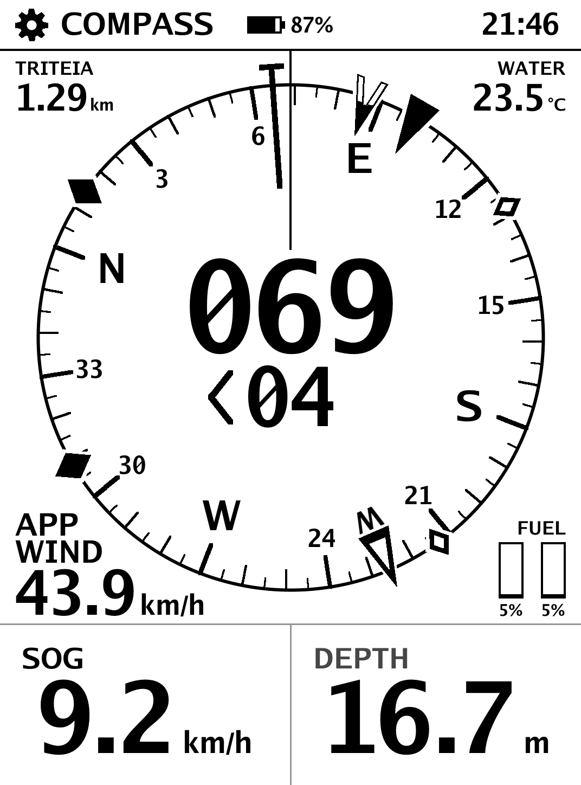
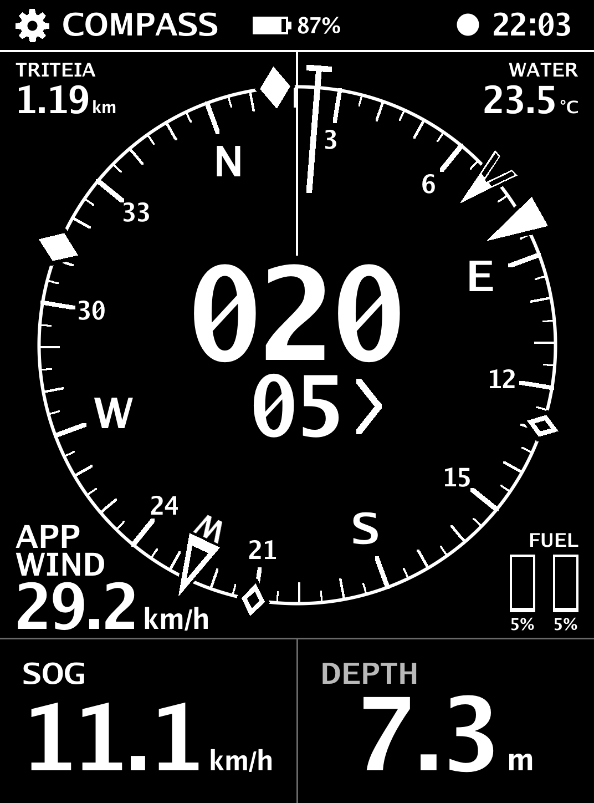
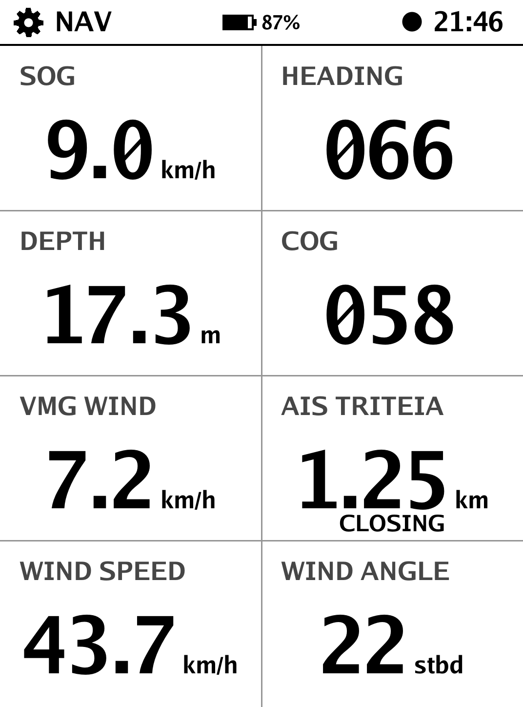
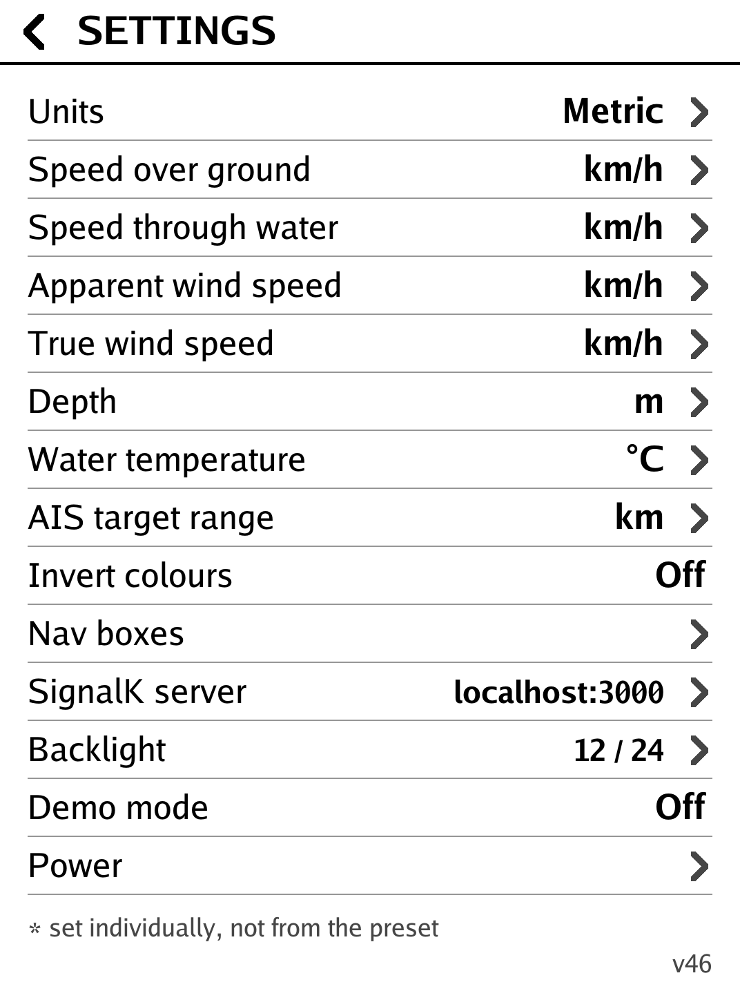
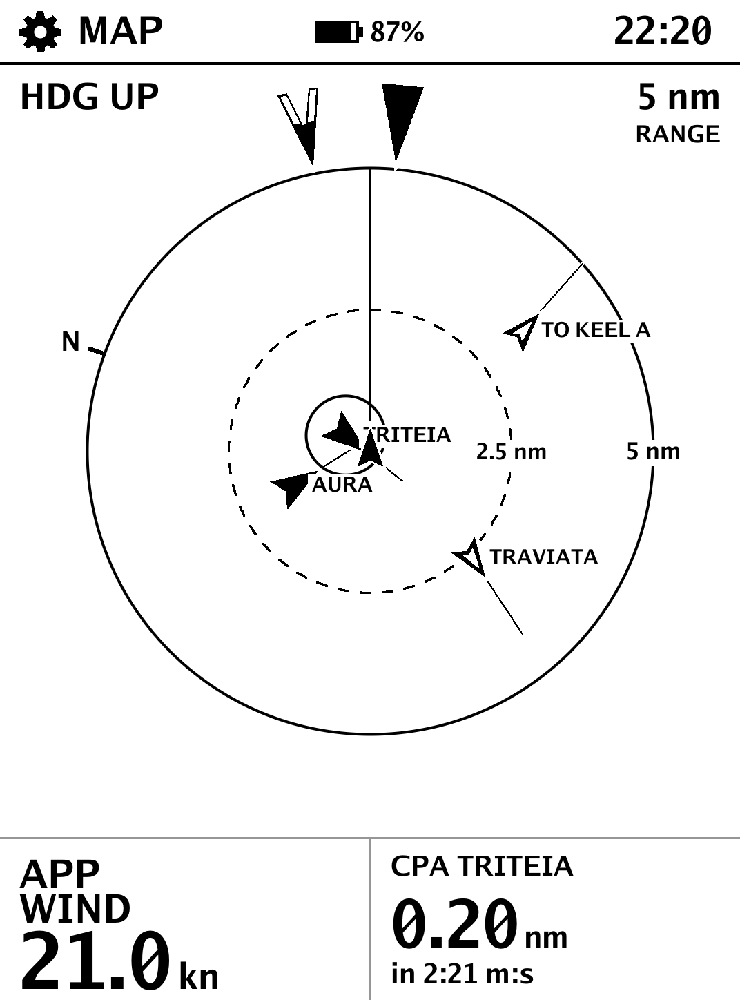
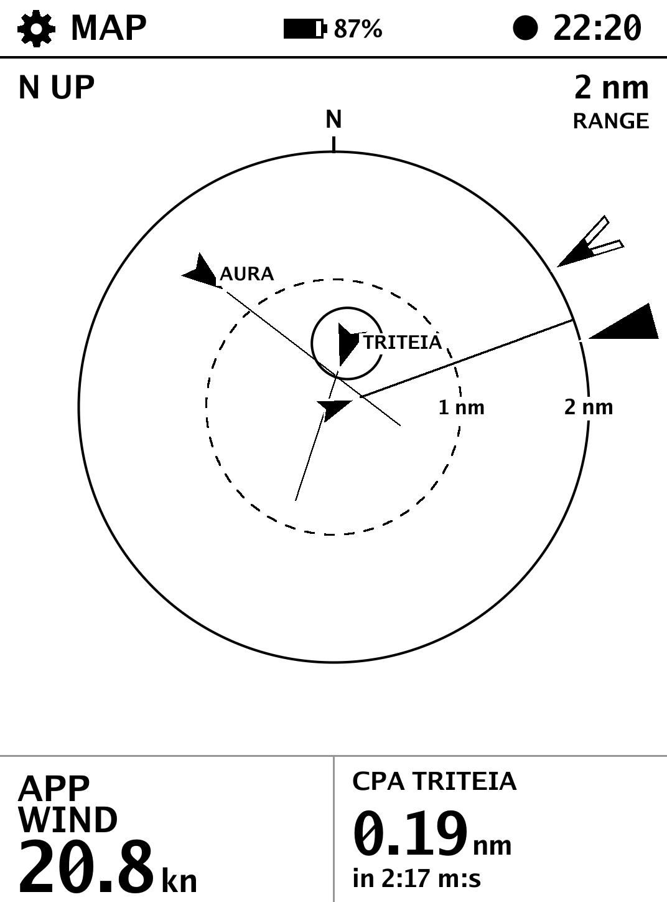
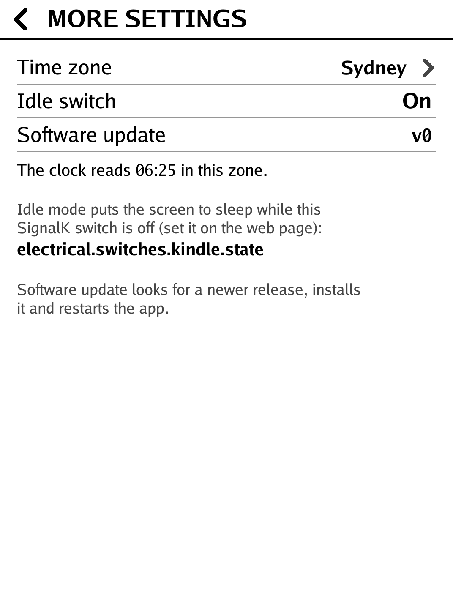
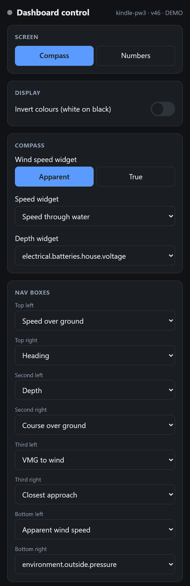
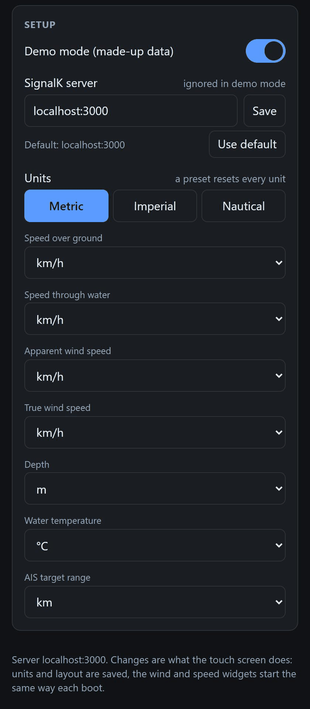

# SignalKPaperDisplay

An interactive e-ink display for [SignalK](https://signalk.org/) data
(speed, heading, depth, wind, and AIS targets by bearing relative to your
heading), meant to run on Kindle and Kobo readers mounted on a boat, fed
from an OpenPlotter/SignalK server.

It's a single static Go binary that connects straight to SignalK's
WebSocket, draws the screen itself, and (once added) reads the touchscreen
to switch pages. Because it's pure Go with no C dependencies, one Docker
build image cross-compiles every target.

## Screenshots

What the Kindle shows - these are the app's own frames, the same pictures it
sends to the screen (here a Paperwhite 3, 1072x1448; other screens are the same
layout scaled), drawn from a SignalK server's data:

<table>
<tr>
<td align="center"><br><b>Compass</b></td>
<td align="center"><br><b>Inverted</b><br>(Settings, or the web page)</td>
<td align="center"><br><b>Nav</b><br>(eight boxes, any value)</td>
<td align="center"><br><b>Settings</b></td>
</tr>
<tr>
<td align="center"><br><b>Map</b><br>(5 nm, heading up)</td>
<td align="center"><br><b>Map</b><br>(2 nm, north up)</td>
<td align="center"><br><b>More settings</b><br>(time zone, idle, update)</td>
<td align="center"><br><b>Idle</b><br>(a SignalK switch is off)</td>
</tr>
</table>

And the web page that controls it from a phone or laptop (see "Remote
control" below), here on a phone-width screen with a few widgets changed from
their defaults: the compass speed and depth widgets, and a raw SignalK path in
a Nav box. The second half of the page, Setup, covers demo mode, the SignalK
server and the units.

<table>
<tr>
<td align="center"></td>
<td align="center"></td>
</tr>
</table>

## Status

Early, but running on a real Kindle Paperwhite 3. Working now:

- SignalK client + data model with staleness tracking
- A **Map** page: a round, radar-style map with our boat in the middle and the
  AIS ships around it, out to 1, 2, 5 or 10 nautical miles (5 by default; tap
  the range in the top right corner to change it). Each ship is a dart pointing
  along its course - solid if it is getting nearer, hollow if not - with a line
  showing where it will be in ten minutes, and its name for the nearest few; the
  one that will pass closest is ringed, and its closest approach (CPA) and the
  time to it (TCPA) are shown underneath, beside the wind. Heading-up (ahead is
  up the screen, like the compass card) or north-up (tap the top left corner);
  the apparent and true wind are marked outside the ring, as on the compass, and
  a tap on the wind figure switches true and apparent. Ranges are written in
  your distance unit ("5 nm" on the nautical preset, "9.26 km" on metric).
- Pages: a large rotating Compass and an eight-box Nav grid (SOG, heading,
  depth, COG, VMG, the closest AIS contact, wind speed and angle), selectable at runtime.
  VMG is velocity made good to the wind: boat speed (through the water if sent,
  else over the ground) times the cosine of the true wind angle, so it needs
  true wind direction and heading. COG shows "--" while barely moving.
  What each Nav box shows is chosen in Settings > Nav boxes (a paged picker),
  from: SOG, STW, COG, heading (true and magnetic), VMG to wind and to the
  waypoint, depth, water and air temperature, air pressure, humidity, apparent
  and true wind, waypoint bearing / distance / time-to-go / time at current
  speed / ETA / cross-track error, closest point of approach (CPA) and time to
  it (TCPA) for the ship that will pass closest, the closest AIS contact,
  rate of turn, pitch, roll, rudder angle, autopilot mode and target, the
  house battery (volts, charge, amps), the engine (RPM, temperature, oil
  pressure, fuel rate) and the fresh, grey and black water tanks. Values that
  live under an id (batteries, engines, tanks) show the first by name
- Waypoint data comes from SignalK's course paths (the v2 course API's
  `navigation.course.calcValues.*`, or `navigation.courseGreatCircle` /
  `courseRhumbline.nextPoint.*`). On the compass a hollow arrowhead on the
  rim, pointing outward, marks the bearing to the waypoint, with a "W" under
  it (just inside its base, turned with it, so it isn't mistaken for the wind
  pointer)
- The device's own battery is shown in the middle of the header: a battery
  that fills with the charge, the percentage, and a lightning bolt while it is
  on external power (read from the Linux power_supply class, else lipc)
- Per-metric unit settings (metric/imperial preset plus overrides)
- Drawing via FBInk (~0.9 s per frame on a Paperwhite 3, including our own
  page rendering; skips unchanged frames, rations partial refreshes, fast DU
  waveform for those, flashing full refresh periodically and on page
  change), or the Kindle's built-in `eips` as a fallback, plus PNG preview
  output for working on a PC
- A launcher that keeps it running, rolls back a bad update and restores the
  stock UI if it can't stay up (see "Running it on the Kindle")
- Touch: tap the left/right third (or swipe) to change page; tap the cog
  at the top left to open settings
- On the compass page two things can be tapped: the wind speed widget (bottom
  left) switches between apparent ("APP WIND") and true ("TRU WIND"), and the
  speed box under the compass cycles SOG, speed through water (STW) and VMG,
  with its label saying which. Neither is saved: every boot starts on apparent
  wind and SOG. A tap there wins over the left-third "previous page" tap
- The compass page is also the dashboard: AIS contacts as diamonds on the rim
  (solid = closing, hollow = opening, bigger = nearer), the wind as two markers pointing in at the
  rim - the apparent wind an "A" (a solid head over two hollow legs) and the
  true wind a solid arrowhead, the true one drawn only when it is more than 10
  degrees from the apparent -, the nearest contact's
  name and distance top left, water temperature top right, apparent wind speed
  bottom left, fuel gauges bottom right. Each of these is drawn only once the
  server has sent that data, and shows "--" if it later goes stale
- Settings: the imperial/metric/nautical preset, a unit for every metric, and
  an "Invert colours" switch (white on black), and the SignalK server address
  (typed on an on-screen keypad; the app reconnects at once), saved to
  `settings.json` beside the app (tap the back arrow to leave). A server set
  there beats the launcher's `SIGNALK_HOST` / the `-signalk` flag, which is
  only the default until one is chosen
- A backlight setting (Settings > Backlight): a tap bar, minus/plus, off and
  max. The light is driven through the device's sysfs backlight, or failing
  that lipc, as described in the platform's `profile.json` (`frontlight`); the
  setting is hidden where there is none. The level is saved and re-applied
  when the app starts
- The log can never fill the device: only slow or failed refreshes are logged
  (unless `-verbose`), the app empties its log at `-log-max` (256 KB), repeated
  connection failures are logged once, and the launcher trims it as a backstop
- A clock in the header, drawn by the app, with a heartbeat dot beside it that
  blinks every second (redrawn as its own tiny region, so it costs almost
  nothing) - if it stops, the app or the panel has hung
- A header guard: the stock UI's status bar keeps running after the Kindle
  framework is stopped and paints its clock over our header each minute. Since
  an unchanged frame is never resent, that clock would stay put, so the header
  strip is repainted every 10 s and just after each minute starts
  (`-header-guard`, 0 to turn it off)
- Self-update from GitHub releases (see below)
- One-command install and uninstall scripts for each Kindle platform (see "Installing")

Not built yet: a timezone setting (the clock is the Kindle's own local time), an
update-now button in settings (updates are automatic every 6 hours, or
`./paperdisplay -update`), and direct framebuffer drawing (the app draws through
FBInk, refreshing small regions where it can).

## Running it on the Kindle

The app is started and watched by `platforms/kindle-pw3/install/startpaper.sh`,
run from cron once a minute. It's idempotent: it never starts a second copy,
keeps the screen awake, stops the stock UI when it takes over, counts
crashes (3 in 10 minutes rolls back to `paperdisplay.prev`; 5 restores the
stock UI until the crashes age out), and `touch /mnt/us/signalk/disable`
stops the app and brings the stock UI back within a minute.

### Installing

You need a Kindle that is jailbroken, with KOReader installed and its SSH
server working (the launcher uses KOReader's Dropbear). Then, **on the Kindle**
(an ssh session, or KOReader's terminal), one command does it all:

```
curl -sL https://raw.githubusercontent.com/takigama/OpenBoatExperiments/master/SignalKPaperDisplay/install.sh | sh -s -- --signalk <host:port>
```

where `--signalk` is your SignalK server. It works out which Kindle this is and
whether there is a profile for it (`platforms/devices.txt`), and says so. If
there isn't, it stops without changing anything and tells you to run the
collector described under "Adding a device". If there is, it downloads the app
(checked against its published SHA-256) and FBInk, writes `launcher.conf`, adds
the launcher to the Kindle's crontab (through `mntroot rw` ... `mntroot ro`,
backing the table up first), starts it, shows you the log, and leaves an
`uninstall.sh` beside the app. It is safe to run again to update.

Add `--check` first to see what it found and what it would do without changing
anything. Other options: `--platform NAME` (use a profile the Kindle wasn't
matched to), `--ref TAG` (install an older release), `--remove-startssh`,
`--no-cron`, `--no-start`, `--dir`; `--help` lists them.

From a PC instead, the same script reaches the Kindle over ssh (the Kindle still
downloads everything itself, so it needs internet):

```
sh install.sh --host <ip-address> [--port 2223] --signalk <host:port>
```

To take it off again and give the Kindle back to the stock software, on the
Kindle:

```
sh /mnt/us/signalk/uninstall.sh
```

or, even with the files gone, `curl ... install.sh | sh -s -- --uninstall`, or
from a PC `bash platforms/<platform>/install/uninstall.sh <ip-address> [port]`.
(`--keep-ssh` leaves the launcher doing just its ssh keep-alive; `--purge` also
deletes the files and settings.) With the launcher gone, ssh stays up only until
the next reboot; start it again from KOReader's menu.

#### Developing: installing a local build

`platforms/<platform>/install/deploy.sh <ip-address> [port] --signalk <host:port>`
(`kindle-pw3` or `kindle-basic`) is the developer's route: run on a PC with WSL
(or Linux), Docker, git and ssh, it builds the app and FBInk if they aren't
built yet and pushes *your* build to the Kindle over one ssh connection,
checking checksums, then does the same configuration, cron and start steps.
`--files-only`, `--no-cron` and `--no-start` skip steps.

FBInk is built by `bash tools/fbink/build.sh`: KOReader's bundled `fbink` has
image support compiled out, so a full build is made from source in Docker with
KOReader's prebuilt cross-toolchain. The installer downloads a prebuilt copy
committed in `tools/fbink/prebuilt/` (GPLv3, built by that script from FBInk's
v1.25.0 sources) with its checksum. `bash scripts/test_install.sh` tests the
installer and uninstaller, `bash scripts/test_launcher.sh` the launcher and
`bash scripts/test_install_cron.sh` the crontab editor, against stand-ins for
the Kindle and for GitHub.

A different Kindle needs a platform directory of its own: copy `kindle-basic`,
set the screen size, touch device and (if it has one) front light in
`profile.json`, the stock jobs to stop in `launcher.conf.example`, and a line
in `platforms/devices.txt` that says which Kindle it is. See
`platforms/kindle-basic/README.md` for how to find them.

### Demo mode

Settings has a **Demo mode** switch (the last row). While it is on, made-up
data replaces the SignalK server's: a boat sailing about with wind, depth,
engine, batteries, tanks and four AIS ships (two closing, two opening), the same
feed the dashboard was developed against (`internal/demo`). It goes through the
same code as a real server's messages. Every page shows a black **DEMO** tag in
the header while it is on, and it is never saved, so the app always starts on the
real server. Switching it off drops the demo data and reconnects to the server.
`paperdisplay -demo` starts in demo mode, which is handy for previews with no
server (`-demo -once -page nav -out nav.png`).

### Remote control

The app serves a small web page on port **80** (`-web :80`; `-web ""` turns it
off), so from a phone or laptop on the same network you can open
`http://<the Kindle's address>/` and change what is on screen without touching
it. (If port 80 cannot be had - the app is not running as root, or something else
is using it - it serves on 8080 instead, and says so in its log.)

- **Screen** - which page shows (Compass, Numbers or Map).
- **Display** - invert colours, the backlight level (where the Kindle has one), and
  how long off external power before the NO POWER screen (see "No-power mode"),
  with a **Wake it** button while it is showing.
- **Map** - its range (1, 2, 5 or 10 nm) and heading-up or north-up.
- **Compass** - the wind widget (apparent or true), and two widgets that can show
  anything: the **speed widget** (bottom left, SOG until you change it; a tap on
  the screen still cycles SOG, STW, VMG) and the **depth widget** (bottom right,
  depth on every start). Each can show any of the Nav box values (battery volts,
  closest approach, ...) or **any numeric SignalK path** the server is sending,
  chosen from a searchable list of what it has.
- **Nav boxes** - what each of the eight boxes shows, the same choices (and the same
  raw SignalK paths).
- **Setup** - **demo mode** on or off, the **SignalK server** (`host` or `host:port`;
  "Use default" goes back to the launcher's), and the **units** (a preset, then any
  unit individually), as the settings screen does. Changing the server moves the
  connection at once; if the new address is wrong the header says NO DATA, and
  it can be put right from the same page. Also here: the **time zone** (any name
  from the tz database, with the common ones suggested; empty is the Kindle's own),
  **idle mode** and its SignalK switch, and an **Update now** button (see "Time
  zone", "Idle mode" and "Updating from GitHub").

Each change does what the same change on the touch screen does: the units, the
layout, invert and the backlight level are saved; the wind, speed and depth
widgets, and the map's range and orientation, start the same way (apparent
wind, SOG, depth, 5 nm heading-up) on every boot. A raw path is written in your
units: the server's own units for it are asked for (SignalK's `meta`), and without
them it is worked out from the path's name (`...speedApparent` is a speed,
`...temperature` a temperature, `...oilPressure` bar, and so on); a path it cannot
make sense of is shown as a plain number. A value that stops arriving shows dashes
once it is later than the path's own rhythm allows, like the built-in boxes.

The same thing as a JSON API, for scripts and home automation:

```
curl http://kindle/api/state                      # everything, as JSON
curl http://kindle/api/paths?q=wind               # the SignalK paths available
curl -X POST -H 'Content-Type: application/json' http://kindle/api/control \
     -d '{"page":"nav","invert":true,"brightness":12,"windTrue":true,
          "speed":"path:environment.depth.belowTransducer","depth":"batv",
          "boxes":{"0":"depth","5":"path:propulsion.main.oilPressure"}}'

curl -X POST -H 'Content-Type: application/json' http://kindle/api/control \
     -d '{"page":"map","mapRange":2,"mapNorthUp":true}'

curl -X POST -H 'Content-Type: application/json' http://kindle/api/control \
     -d '{"demo":true,"server":"192.168.1.20:3000",
          "units":{"preset":"nautical","overrides":{"depth":"ft"}}}'
```

Every field is optional. `boxes` is an object from box number (0 to 7, left to right
then top to bottom) to kind, or a list of all eight; kinds are the IDs in
`/api/state`, or `path:` and a SignalK path. If anything in a request is wrong, none
of it is applied, and the reply says which field.

It is plain HTTP for a boat's local network, like the SignalK server it reads
from: **anyone on that network can use it**. Besides what is on screen it can
change the demo switch, the server address and the units - the Setup section above -
which is what to think about before leaving it open: `-web-config=false` turns
those off (it then changes only what is on screen). It cannot touch the power. To
require a token, start the app
with `-web-token SECRET` (put `EXTRA_ARGS="-web-token SECRET"` in `launcher.conf`):
then every request needs it, as `Authorization: Bearer SECRET`, or open
`http://kindle/?token=SECRET` once in a browser, which remembers it. The page
works with no internet. On a Kindle whose launcher is not set to keep ssh and the
network open (`KEEP_SSH=0`), its firewall may block the port.

### Power

While the dashboard runs, the Kindle's own software is stopped, and the power
button is ignored by the Kindle itself (it ignores the button for as long as the
screensaver is prevented, which is how the dashboard stays awake). So the app
has its own way to switch off: **Settings, Power**, or a press of the **power
button**, opens a screen with three choices, each asked about again:

- **Kindle software** - stops the dashboard and starts the Kindle's own screens
  (the launcher's `disable` file). To bring the dashboard back, delete
  `/mnt/us/signalk/disable` (over ssh), or run the installer again.
- **Restart** - reboots; the dashboard starts again by itself.
- **Power off** - switches the Kindle off; the power button starts it again.

The last picture says what happened, since an e-ink screen keeps it with no power.
The power button is heard through the kernel's own announcement of the press
(`paperdisplay -key-test` prints every one), which is recognised by the power
chip's driver: `bd7181x` on the Kindle 8th generation. On another Kindle, run
`-key-test`, press the button, and add the driver it shows to `internal/powerkey`;
until then the settings row does the same job.

### No-power mode

A dashboard that is not plugged in is running on its battery, and there is no
point keeping the screen current when nobody will see it before the battery is
flat. After the Kindle has been **off external power for an hour** (the default)
it goes into no-power mode: the screen shows one huge **NO POWER** (on two lines),
and everything that costs power stops - the screen is no longer redrawn (an e-ink
screen keeps its picture with no power, so the message costs nothing to leave up),
the SignalK connection (and the demo feed, if that is on) is dropped, and the
front light is switched off. The Kindle's Wi-Fi stays on, so the web page can still
reach it.

It comes back, with the screen redrawn, the light at its old level and the
connection remade, as soon as power is plugged in. A **tap on the screen**, a
press of the **power button**, or any command from the **web page** (or its Wake
button, or `{"wake": true}` in the API) wakes it too, and it then waits a whole
timeout again from there. It never blanks while someone is using it (30 seconds
since the last touch or command), and with no battery reading at all it never
goes to NO POWER.

The timeout is a setting: **Settings, Power, No-power mode** (1, 5, 15 or 30
minutes, 1, 2, 4 or 8 hours, or **Never**), or **No-power mode after** on the web
page; the API takes any whole number of minutes from 1 to a week, or 0 for never
(`{"noPowerMinutes": 90}`). It is saved. It does not suspend the Kindle itself:
that is a deeper saving, but one the Kindle then cannot be reached through.

### Idle mode

Idle mode puts the dashboard to sleep from the boat's own wiring: it follows one
SignalK **switch**, `electrical.switches.kindle.state` unless you choose another.
While that switch is **off** the screen shows one big **IDLE** (and the switch's
name), nothing is redrawn, the front light goes off, and the SignalK connection is
cut down to that one path - the app subscribes to the switch alone (the stream is
opened with `subscribe=none`, then the switch is subscribed to) and keeps the link
alive with pings, since a switch can stay put for days. **On** wakes it: the light,
the whole connection and the page come back.

A **tap**, the **power button** or any command from the web page wakes it too. The
switch is still off then, so idle mode stays out of the way for five minutes after
that, and goes back to sleep after five quiet minutes; flipping the switch on and
off again starts it afresh. Like no-power mode it never blanks while someone is
using the screen (30 seconds since the last touch). The two share the sleeping
screen: if the battery runs out while idle, NO POWER takes over and the light
stays off until both are over.

It is off until you turn it on: **Settings, More settings, Idle switch**, or
**Idle mode** on the web page (`{"idle": {"enabled": true}}`). The switch's path is
set on the web page (`{"idle": {"path": "electrical.switches.nav.state"}}`, or `""`
for the default); the settings screen shows which one it is. It is saved. The value
can be a boolean, a number (0 is off) or a word (`"on"`/`"off"`); a value that is
none of those, or a server that has said nothing, never puts the screen to sleep.
It is ignored in demo mode.

### Time zone

The Kindle's own time zone is whatever its stock software left, which is often UTC,
so the header clock (and the arrival times in the Nav boxes) can be wrong for the
boat. **Settings, More settings, Time zone** picks one from a list of the places
boats go (three pages, each with its UTC offset right now, the device's own first),
and the web page takes **any** name from the tz database, such as
`Australia/Sydney` (`{"timezone": "Australia/Sydney"}`). Daylight saving follows the
zone. The zone database is built into the program, so it does not depend on the
Kindle having one. It is saved.

### Plugging it into a PC

Use a wall charger, not a PC's USB port, while the app is running. A USB data
connection puts the Kindle in "drive mode", which hands `/mnt/us` (where the app,
FBInk and KOReader's ssh server live) to the PC: the display freezes on its last
frame and ssh stops until you eject it, when everything carries on by itself. (If
the app was in the middle of reading its own program file it can exit instead,
and the launcher restarts it within a minute.)

## Updating from GitHub

Devices update themselves from GitHub releases. A manifest in the repo
(`update/manifest.json`) lists, per platform, the newest version, its
download URL and SHA-256. On the device:

```
./paperdisplay -check-update     # report whether a newer release exists
./paperdisplay -update           # install it (then restart the app)
./paperdisplay ... -update-every 6h   # check periodically while running
```

To update by hand, without waiting for the periodic check: **Settings, More
settings, Software update**, or **Update now** on the web page
(`{"update": true}`). It looks for a newer release, installs it, shows what it found
("Up to date: v50 is the newest", "Installed v51: restarting...", or why it
failed) and, after an install, restarts the app; the launcher then starts the new
version within a minute. It does nothing on a PC preview, which would replace its
own program.

The download is verified against the manifest's SHA-256 before anything on
disk is touched; the previous binary is kept as `paperdisplay.prev` for
rollback. Downloads go through `curl` on devices whose profile says
`"fetch": "curl"` (the Kindle), otherwise Go's own HTTP client.

To publish a release: bump `VERSION`, run `bash scripts/release.sh` from WSL
(builds every platform, creates the GitHub release, rewrites the manifest),
then commit and push `update/manifest.json`. Devices only see the new
version once the manifest is pushed.

## Layout

```
cmd/paperdisplay/      the one binary; device chosen at runtime by -profile
internal/signalk/      data model + WebSocket client (local-receive-time stamps)
internal/render/       grayscale drawing toolkit (rects, lines, antialiased text)
internal/pages/        screens: pure functions, snapshot -> canvas, no I/O
internal/display/      Display interface; PNG (preview) and Kindle eips drivers
internal/profile/      reads a platform's profile.json
internal/app/          render loop tying state, pages and display together
internal/web/          the remote control web page and JSON API
internal/demo/         the simulated boat for demo mode
internal/powerkey/     the power button, heard as a kernel uevent
platforms/<name>/      one directory per device (see below)
Dockerfile, Makefile   reproducible Docker build, one make target per platform
```

Code under `internal/` never mentions a specific device. Everything that
differs per device lives in `platforms/<name>/`:

- `profile.json` - screen size, gray levels, touch device and protocol
- `build.env` - `GOOS`/`GOARCH`/`GOARM` for the cross-compile
- `README.md` - hardware notes and what's still unverified
- later: the launcher/install scripts for that device's stock OS

## Adding a device

On a rooted Kindle with SSH or a terminal (KOReader's will do), one command
prints a read-only report of everything a new profile needs: screen size and
DPI, the touch panel and its protocol, front light, stock jobs, cron, and a
suggested `profile.json` and `build.env`. Paste it into an issue:

    curl -sL https://raw.githubusercontent.com/takigama/OpenBoatExperiments/master/SignalKPaperDisplay/tools/kindle-probe.sh | sh

It changes nothing and prints no MAC or IP address, WiFi names or full serial.
Start the new platform by copying `platforms/kindle-basic` and applying the
report; add a line for it to `platforms/devices.txt`.

1. `mkdir platforms/<name>` with `profile.json` and `build.env`.
2. `make <name>` - the Makefile discovers it automatically.
3. If the device needs a different way of drawing or reading touch, add an
   implementation behind the `Display` interface (or the input equivalent)
   and select it through the profile - don't branch on device names in pages.

## Building and trying it

```
make image        # once: build the Docker build image
make test
make host         # native binary for previews -> dist/host/paperdisplay
make kindle-pw3   # device binary -> dist/kindle-pw3/paperdisplay
```

Preview against a SignalK server (for example the fake-data one used during
development) without touching a device:

```
dist/host/paperdisplay -signalk localhost:3001 \
    -profile platforms/kindle-pw3/profile.json -once -out out/nav.png
```

## Design notes

- **Staleness is a first-class concept.** Every value carries the local time
  it arrived; anything older than 5 seconds renders as `--`, and a black
  "NO DATA" banner appears if the server link drops. A frozen screen must
  never look live.
- **Pages are pure.** A page only turns a snapshot into pixels, so each is
  checked as a PNG on a PC and runs unchanged on every device.
- **No per-device C toolchain.** FBInk, the one C dependency, is run as a
  prebuilt binary on the device rather than linked in.
